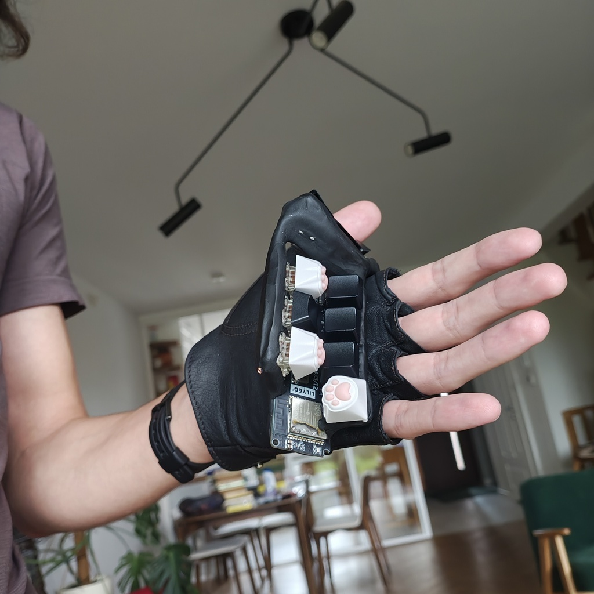
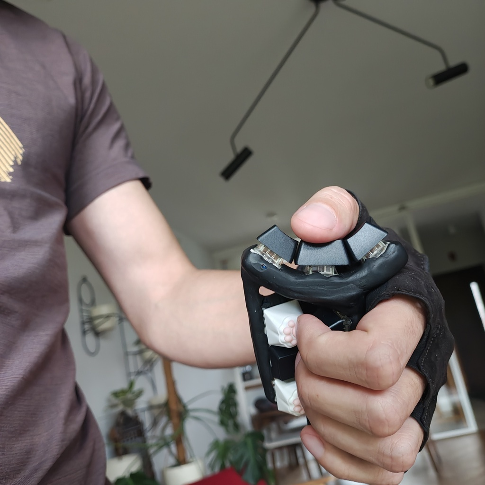
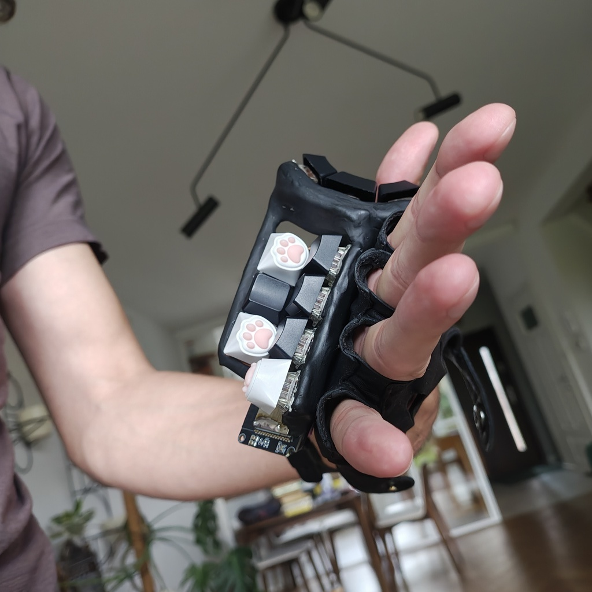
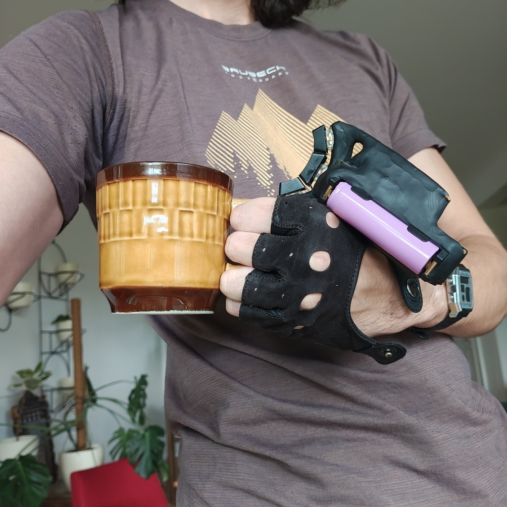
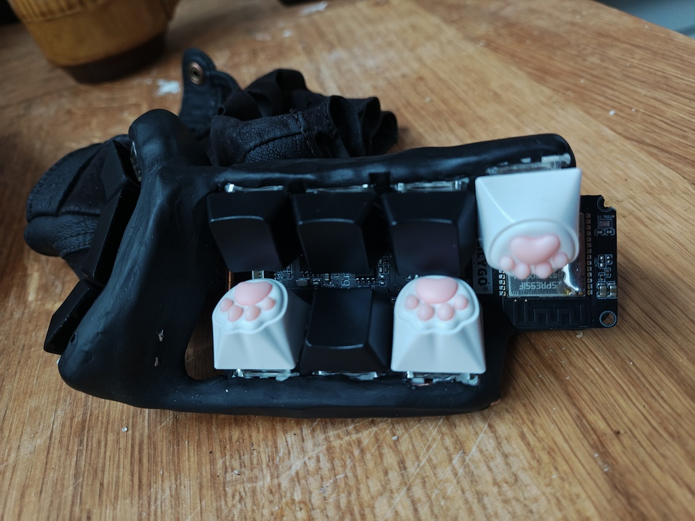
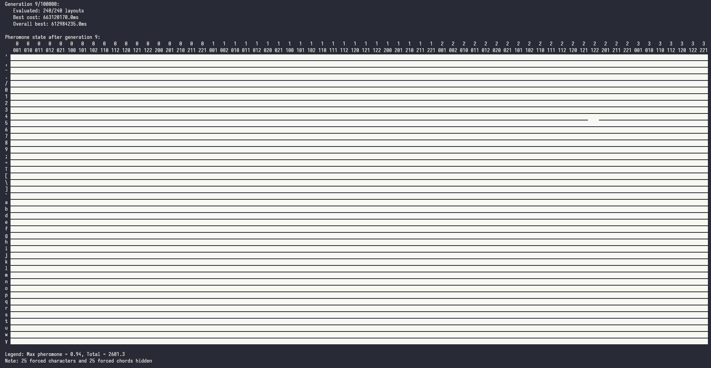
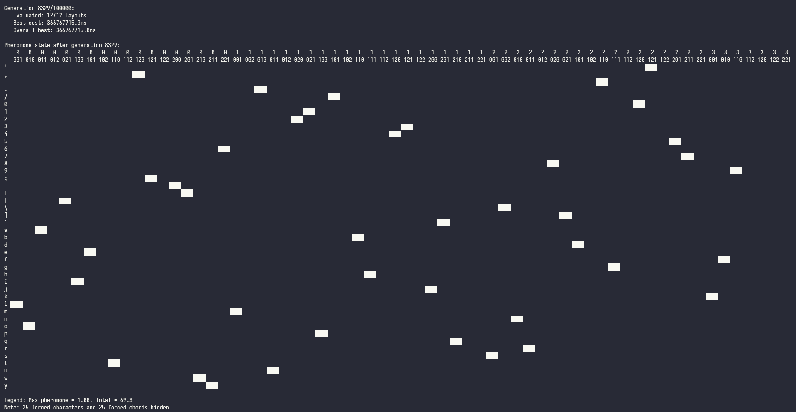

# 𝖒𝖆𝖋's Keyer 🎹

Firmware & goodies for making a [Keyer](https://en.wikipedia.org/wiki/Keyer) (one-handed version of a [chorded keyboard](https://en.wikipedia.org/wiki/Chorded_keyboard)).

<table>
  <tr>
    <td></td>
    <td></td>
  </tr>
  <tr>
    <td></td>
    <td></td>
  </tr>
  <tr>
    <td></td>
    <td></td>
  </tr>
</table>

**Features**:

- **Minimal finger movement**: it's like typing with all the keys on your home row all the time
- **Free hand while typing**: you can use your other hand to sip tea while typing (or move the mouse - if you're not a tea drinking type)
- **Always near your hand** - keyer can be attached to a glove so you can just release it and have both of your hands free. Now you can drink your tea and move the mouse at the same time.
- **Tons of chords**: a 10-key keyer (3 keys on thumb, 2 index, 2 middle, 2 ring, 1 pinky) can express up to 215 chords (&times; 2 when counting hold-chord alternatives). With so many chords you can lose a finger and still touch type (carpenters will love it!)
- **Arpeggios**: an additional 2 &times; 78 arpeggios - rolling motion over two keys that can be executed in two directions and can be used for even more input options.
- **Multiple layers**: if the 586 shortcuts available on the base layer are somehow not enough for you
- **Rolling chords**: when two subsequent chords you're entering share some finger positions you can only move the finger that changes position. When combined with optimized layouts (see the next point) typing is like walking through the keys one finger at a time.
- **Optimized layout**: a bundled layout optimizer will perform a combinatorial search over all possible layouts to find the optimal one for typing the texts that you give it (or for your custom finger press / finger movement cost function). Then learn to type with it in the [keyer flight school🛦](https://mafik.github.io/keyer/).
- **Ergonomic layout 🖖**: did you know your fingers share the neuro-motor pathways and can't always move independently? The layout generator will avoid finger combinations that are hard to press.
- **Low-latency**: the firmware uses hardware interrupts to be more responsive than polling-based keyboards and it also does debouncing in software to be more responsive capacitor-based debouncers.
- **Power for months**: a massive 18650 battery + underclocked CPU + firmware able to sleep without losing the Bluetooth connection + hardware power switch on the board mean that you will charge it about as often as a Casio watch.
- **🕶️**: combine it with smart glasses to control your computer (or smartphone) without looking or touching. It's like [Meta EMG wristband](https://www.youtube.com/watch?v=wteFJ78qVdM) but actually working!
- **Easy to build**: did you ever play with Play-Doh? This keyer was built with modelling clay (baked in the oven for 30 minutes). No 3D printing. No custom PCBs. You can make it with parts from amazon, a hot glue gun and a soldering iron.
- **Perfect fit**: you build it yourself, literally molding it to the shape of your hand. You can't get more ergonomic than that.
- **Cheap to build**: it's less than 50 USD to make one yourself. Mechanical keyboards are a cheap hobby now. Who would have thought!

Typing video [youtube.com/watch?v=Ijwo7SQQ73Q](https://www.youtube.com/watch?v=Ijwo7SQQ73Q) (from Typeware).

## 🐾 Links (a.k.a. 💫 Awesome Keyers 🎹)

(Send me your links on Bluesky [bsky.app/profile/mrogalski.eu](https://bsky.app/profile/mrogalski.eu) so that I can add them here!)

- [Penti Chorded Keyboard](https://software-lab.de/penti.html) - A software keyer that can run on a touchscreen. Notable for its use of arpeggios.
- [ESP32-BLE-Keyboard](https://github.com/T-vK/ESP32-BLE-Keyboard/tree/master) - Excellent library for turning ESP32s into custom keyboards.

**3d-printed keyers**:

- [Keyyyyyyyys!](https://www.stavros.io/posts/keyyyyyyyys/) - Can you get scrappier than that?
- [Ignacio's keyboard](https://medium.com/@tartavull/thor-your-next-keyboard-20b9ce7dd2b1)

**Commercial products**:

- [Twiddler](https://www.mytwiddler.com/) - 19 tiny keys + touchpad for $229
- [Decatext](https://decatxt.com/) - 10 large keys + typing guide right on the device for $175 (its author also shared the promo code "Neural" for $15 off!)
- [Typeware](https://typeware.tech/) - ultra lightweight & probably the best all-around design for $273 (pre-orders only 😔)

**Memes**:

- [Mobile Text Entry Device](https://patents.google.com/patent/US20030179178A1/en) - 💩
- [I love the powerglove.](https://www.youtube.com/watch?app=desktop&v=KZErvASwdlU)
- [Johnny Mnemonic](https://www.youtube.com/watch?v=UzRjtvMQds4&t=63s) - it's even funnier when you realize it's not a parody

## Making your own keyer

_Welcome to the bottom of the ergonomic mechanical keyboard rabbit hole._

Let's start with some shopping.

### Bill of materials

- [LILYGO T-Energy S3](https://lilygo.cc/products/t-energy-s3) development board ($9.70)
- [Samsung INR18650-35E](https://www.18650batterystore.com/products/samsung-35e) 3500mAh Li-ion battery (~$2.95)
- [FIMO professional modelling clay](https://www.staedtler.com/intl/en/products/fimo-modelling-clay-accessories/fimo-professional/fimo-professional-8040-oven-bake-modelling-clay-m8040/) ([$2.75](https://www.amazon.com/Staedtler-Professional-Hardening-Modelling-Chocolate/dp/B00WUCFIK8/))
  - Alternatively, one of the [FIMO effect](https://www.staedtler.com/intl/en/products/fimo-modelling-clay-accessories/fimo-effect/) modelling clays if you'd like to make your keyer out of [stone](https://www.staedtler.com/intl/en/products/fimo-modelling-clay-accessories/fimo-effect/fimo-effect-8010-stone-oven-bake-modelling-clay-m8010-stone/)
- 10 &times; [Gateron G Pro 3.0 mechanical switches](https://www.amazon.com/s?k=gateron+brown+10pcs) (~$10)
  - Any other switches of your choice will work
- 10 &times; [Keycaps](https://www.amazon.com/s?k=keycaps+10pcs) (~$8)
  - You only need ten of them so feel free to get the [coolest](https://www.amazon.com/s?k=cat+paw+keycap) keycaps you can find
- 1m &times; AWG 18 rigid, insulated copper wire (~$1)
  - Get it from a local hardware store, the online stores are ripping you off
  - You can come with your development board to see which wire gauge fits through the holes on the board

Total: $34.40 (+shipping)

### Tools

- pliers - for bending the copper wire
- a knife (or a set of sharp teeth) - for stripping the cable insulation
- (optional) nitryl gloves - for not getting dirty while working with the modelling clay
- hot glue gun + hot glue sticks - for attaching the components to a wire scaffolding
- soldering iron + solder wire - for soldering

### Forming a skeleton (day 1)

With all the materials and tools in hand, the first step is to form a metal scaffolding which will hold the switches in convenient positions. Traditional electronics devices tends to have "exoskeletons" - they're supported by an external case that surrounds them and protects them from your greasy fingers. This device is built around an endoskeleton of copper wire. We'll cover this endoskeleton with modelling clay in a moment. I hope you bought the thickest wire you could (while still fitting through the holes on the board) because in this device it's structural.

We'll start with a "GND loop". Cut a section of wire - about 20 or 30cm. Strip its insulation (all of it) & insert it into one of the GND holes on the board. Solder it in place - it should be firmly attached to the board. Insert the battery and take the board in your hand. Position it like you'd like it to stay in your hand and start bending the wire into a loop that goes through all the places where key switches bases are going to be placed. For some extra rigidity (long wire behaves a little like a spring) lead the other end of the wire back into another GND hole on the board. You can take the switches with keycaps and place them so that one of their contact points touch the wire. This will give you a better idea of how the keyer is going to end up looking. Don't worry about it being wobbly - we'll use this property to model it a little in a moment. First complete the loop by soldering the other end of the GND loop to the board. If your GND loop happens to pass near other GND holes, you can insert short sections of wire and solder them to the main GND loop as additional supports. This will increase the rigidity of the construction.

Once GND loop is complete, take your key switches and attach them to the GND loop so that one of their contact points makes an electrical contact. You can solder them directly but it's a good idea to start with some hot glue to hold them in place. In my version I also bent the contacts on the key switches to make them smaller (DIY low profile) and to take less space.

As you're going through the process the keyer is going to become more "complete" and you will be able to bend the wire a little to improve key positioning. Remember that hot glue and solder don't form particularly strong bonds so be careful about bending and ideally use pliers to do that precisely.

One word of advice about key positioning is that I've noticed that the keys are "nicest" to press when the axis of pressing goes straight into the palm of your hand. Motions that go parallel to palm of the hand, motions that extend fingers and motions that move fingers to the side are pretty awkward and uncomfortable. I guess our hands evolved to hold things, rather than poke or flick at them. [Some keyboard manufacturers](https://www.charachorder.com/) might disagree. Their keyboards look undeniably awesome, but this is your keyer and it should be comfortable to use - so make sure the keys are pressed in the same direction that you'd hold something.

Once you attached all of the keys, it's time to add even more rigidity into our construction. We'll do this by connecting the remaining contact points on the switches to the GPIO holes on the board. They're marked on the board with text that says "IO##". It doesn't matter which IO port you choose, but write down which key goes to which IO port - it's something that will have to be entered in the firmware. Take a short cut of the wire, strip it at both ends. Bend it (with pliers) so that it fits in the hole and goes straight to the switch. Then solder it in place at both ends. It's important that the wires going to the IO ports don't touch the GND loop. Insulation should help with that.

After this step, the keyer should be fairly rigid. Mount the keycaps and see how it feels. It's obviously a little "spiky" but you'll have to endure the pain for the moment. Right now bend the wires to put all the key switches in their right positions.

At this point you can go to the "Flashing Firmware" section and check out how your keyer works! It's good to see if you didn't mess anything up so far. The hardest part is over!

### Sculpting with clay (day 2)

Now is the time to open up the modelling clay and use it to cover our keyer. Before you begin, remove the keycaps, as they'll only get in the way. Take a small amount of clay and start shaping it in your hand. Squeeze it and fold in half. Repeat this about twenty times. Modelling clay must be mixed a little to prevent it from crumbling. You'll have to do this with every bit of clay that you're adding to the sculpture.

Once you have your warm and soft piece of clay, slap it on top of the keyer - wherever you want to cover something. It's important to cover the bottom parts of the switches - that's the part that may prick your fingers. Everything else is optional. I decided to keep my development board mostly visible and only covered the wires.

As you're sticking pieces of clay, one after another, you may find the resulting shape a little bit ugly. Turns out modelling stuff out of clay is hard! I've found a couple of tricks that may help you:

1. Add clay in **layers**. Take a small ball of clay and place it between two popsicle sticks. Roll it into a flat disc with a rolling pin. Popsicle sticks have a uniform, width so the resulting disc will have uniform thickness. Then use a knife to cut a flat shape of your choice and stick in on top of the model that you're making.
2. If you see a gap between chunks of clay - **rub them**. Keep rubbing them until the gap disappears. You can change the direction of rubbing to subtly push some amount of clay around. It can be used to even up tiny hills and valleys.
3. The best way of evening uneven edges is to use a **knife**. Ideally a wallpaper knife. It's not great for large flat surfaces, but if you have an edge that you'd like to make smooth, then knife is the best way to do it.
4. This is a cool one but it's going to be useful right at the end. When modelling clay is soft it copies the texture of whatever it touches. You can use a piece of fabric to make it look like a fuzzy fabric. If you take a glass you can make it glossy. Look around you and see what nice textures you have around.

You can try to take the keyer in your hand at this point but be careful. The clay is very pliable and may deform under the pressure of your hand.

One useful thing at this point is to try to put on the keycaps and to see whether they can be pressed all the way in. If they cannot - then either the clay (or the keycap) has to be trimmed. At this point the clay is still soft so it's easy to correct it.

Once you're done with modelling (it can take a couple of hours) heat up an oven to 110°C and put your keyer inside. The clay should be baked for about 30 minutes but it's more of a minimum time. Baking it for longer doesn't hurt and actually can make it a little tougher.

Oh, I hope you removed the battery before putting the keyer in the oven. If you didn't then you'll have to get a new one (oven). And call the fire department.

Assuming you removed the battery beforehand, after baking, the clay should be fairly tough - roughly as hard as high quality plastic.

### Flashing Firmware (day 3)

1. [Install PlatformIO Core](https://docs.platformio.org/page/core.html)
2. Connect the T-Energy S3 development board to your computer via USB.
3. Run these commands:

```shell
# Clone this repository
$ git clone https://github.com/mafik/Keyer.git

# Enter the cloned directory
$ cd Keyer

# Build project
$ pio run

# Upload firmware
$ pio run --target upload
```

4. Open Bluetooth settings on your phone or PC. If you see a device called "𝖒𝖆𝖋.🎹", that means it's working. If it doesn't skip to step 6.
5. Go to a text editor and find `ChordKeyboard.cpp`. Change the `kButtonPin` array to the IO ports that you used for connecting the switches. You can also rename the keyer by replacing "𝖒𝖆𝖋" with your name. Bluetooth names may be truncated to 16 bytes so you don't have a lot of emojis to work with. Feel free to explore this file and experiment.
6. Enable serial output by changing the `kDebug` to `true` and running the program with `pio run --target upload --target monitor`. This will let you see what the board is doing while you're fiddling with the code and pressing the keys.

Alright, that's it! You may wonder - how it is possible that we've finished the work for today in like an hour? Well - it may not be an hour on your system. Technology has a bad habit of surprising us in the most unpleasant ways. It's possible that you will have issues installing PlatformIO. Or that your PC won't have a BLE receiver. Or one of a thousand other reasons. That's why whenever you're doing something on a PC, book 10x the time. If it all goes according to plan - then it's a nice surprise. It's much better to be surprised in positive ways than in negative ones. So set your expectations low and don't get disappointed if some technical issues pop up. And - if you've been lucky and everything worked smoothly, enjoy the rest of the day! You earned it.

### 🌌 Optimizing layouts (day 4)

Everybody has different typing patterns and what works best for me will likely not be the best one for you. This is especially important for a keyer. Do you intend to use your keyer to play games? Or chat with AI? Blast terminal commands? Write notes? Emails? A custom keyboard layout will help you be more efficient at doing the things you're doing. The default layout was optimized to minimize the text entry time for a mix of English, Polish, C++ and Python code. That's probably not exactly what you'll be using your keyer for. That's why it's worth taking a moment to do this properly - and make a custom layout just for yourself.

If you want to squeeze out the maximum efficiency then you might be interested in the ability to write **complete words** by pressing a single chord. Yep, that's right - you can program a chord to enter `¯\\_(ツ)_/¯`. Or your credit card number. Oryour 20-character super secret password of mixed letters, digits and that single punctuation character. It's your keyer - you can trust it with those things.

Multi-character chords are the secret (not so secret any more, heh) trick of stenographers. They just mash a bunch of letters, and the keyboard arranges them into a proper word.

If you think about this, figuring out how to arrange the set of keys on a keyer is actually pretty complicated. Chords can overlap and interact - that's one thing that can be exploited. We could minimize finger movement. Additionally different keys can be pressed with different effort. A thumb is stronger and more dextrous than a little finger. If you think about the number of possible input options (exactly 586 possible shortcuts) and the fact that we like to fill those chords with useful key sequences (what key sequences would be best? single keys? syllables? common words?), things are getting pretty complex. The total number of potential layouts is... Let's just say it's beyond astronomical. It's one of those crazy numbers where the number of digits needed to write it down is already hard to write. Here is a subreddit dedicated solely to exploring this rabbit hole: [r/KeyboardLayouts](https://www.reddit.com/r/KeyboardLayouts/). Be careful before entering. Few of those who enter, return. And we would rather use the keyer to type, rather than figure out how to type.

This is the reason for the `layout_generator/` directory. It contains all the tools you need to make a custom layout - all in a single day. Assuming you have a reasonably fast PC. That's right - you're going to do some serious science on your PC. Essentially it's going to scan this whole "beyond astronomical" space of all potential layouts to find the best one. And that will take some processing power. And a couple clever algorithms. But we'll get to that once we start the optimization process. It'll run for a couple of hours anyway.

Let's start by creating a **corpus**. Take some of your writing (as text files) - and drop it in `layout_generator/corpus`. You can look on your PC for some of your notes. Or copy your chat history. Or grab some online docs. Or that half-finished book you started writing years ago. Grab as many files as you can. My corpus amounted to 2847715 bytes - that's almost 3MB. This will probably take you some time so come back when you're done. Just make sure to store everything in text files, rather than PDFs.

Alright - the next step is to tweak the parameters for finger motion and key press effort. They may be different if your keyer has a different shape than mine. You can change them in `keyer_simulator.cpp`. Don't worry too much about being super precise - you can just "feel" how nice each key is to press - and assign it a "cost" in milliseconds. Once you're done, ask some AI chatbot to help you recompile it - it should guide you through the process. Every PC is a little different and AI chatbots know about everything that can go wrong during this process. They eat StackOveflow questions for breakfast.

Another file that you might want to tweak is the `planner.py`. Look at the `main()` function - in there you'll find some code that removes some of the hard-to-type chords from the optimization process. And also some "forced_assignments". You can tweak these to assign some keys to nice, memorable chords. As you can see, some of the chords have been assigned to unused characters (capital letters) that are actually placeholders for common shortcuts. You can leave them as is or change them to your liking. The optimizer was configured to optimize 4-chord sequences and to assume that shift is placed on the pinky finger. Some of the Ctrl+C / V / X / Z combinations have also been assigned so that they are similar to their Ctrl-free versions.

As you're starting out, you may also tweak `layouts_per_generation` (currently 240) to a smaller value - like the number of cores in your CPU. This will allow you to see the optimization results more quickly - and if you're happy with how they look, you'll bump it up back to 240 and let it optimize properly overnight.

If you're going to use some non-english letters, then you should also look at qwerty_analysis.py - it's a file that converts the characters from your corpus into sequences of qwerty-equivalent key presses. Depending on your language you may have to implement this mapping yourself.

Anyway, with all of the adjustments done, run the `planner.py` script. While the script is running we have some time to explain what it does.

https://github.com/user-attachments/assets/4c7ad9f6-67f0-450c-9985-fa53694d1321

I used the word "beyond astronomical" before. And space (cosmos) is actually a good metaphor to imagine the search process. Let's say we're looking for gravity wells. The bigger the better. Ideally - the supermassive black holes in the centers of galaxies. And not just any supermassive black holes. We want to find the biggest one in this whole universe. That's the optimal layout that we're looking for. During our search we have one major limitation - we can only check this space one point at a time. The `score_layout` function from `keyer_simulator.cpp` can take any point in this space (any layout), and measure how deep is the gravity well at this point (how fast it is to type with it). It's a rather expensive process. That's why this bit is implemented in C++ and optimized quite a bit.

You may have heard of fancy machine learning algorithms based on gradients - but hold your horses. We're dealing with a combinatorial problem here. We can swap a pair of keys to improve or lower the score - but it's not a continuous space. There is some smoothness here - that's true. We can imagine our optimal layout somewhere out there. The layouts that are very similar to the optimal one (one key swap away) are probably also decent. And the layouts one step further are probably also quite acceptable. But this kind of smoothness can't be used to create a "direction" that we could optimize in.

Most of the points that we can randomly pick in this space will contain total garbage layouts. Keys that should be close together have very little chance of actually being placed reasonably. That roughly matches the space analogy. If you pick a random point anywhere in the universe, you'll likely end up somewhere far from any galaxies. The fancy term for this search strategy is [random search](https://en.wikipedia.org/wiki/Random_search). Using this approach would give us pretty awful results though. The space is really large. The chance that we'll hit the deepest gravity well in the universe by pure luck are pretty slim.

Another approach is to focus our search near some good points. Like picking mushrooms in a forest. You find a mushroom 🍄‍🟫? That means there sholud be more nearby. So we can check the neighbourhood of good mushrooms (ekhm... I mean points) more dilligently. We start picking random points throughout the universe and then we progressively start focusing on the nice locations. The fancy term for this approach is [simulated annealing](https://en.wikipedia.org/wiki/Simulated_annealing). Doing this very slowly, mathematically speaking should let us find the optimal point. Unfortunately mathematicial proofs don't translate well into practical algorithms. This is one of those situations. The "very slowly" in mathematics translates to "forever" in practice.

For practical algorithms we'll have to learn from the force of nature that defines what it even means to be practical - from the _life_ itself.

This algorithm is the staple of optimization techniques - an [evolutionary algorithm 🧬](https://en.wikipedia.org/wiki/Evolutionary_algorithm). In this one we have to treat different points in the space that we're searching like living creatures. First we scatter a bunch of points throughout the universe randomly. Then we measure them. Then we kill half of them. Thanos style 🤌. The remaining points have virtual baby points that are a mixture of their parents plus some random mutations. In each iteration of evolution there is some death and there is some life. And some random mutations. Most of the mutations are cancer. But some of them are good. The unlucky cancer babies will die. But the lucky ones will live long enough to exchange genes. This cool trick (scientifically called meiosis, and colloqually - sex) is why we humans continue to exist and can survive a competition against bacterias that have reproductive cycle measured in hours and vastly greater populations. It's crazy to think what would happen if a germ like COVID-19 figured out sexual reproduction...

Anyway, from our layout search perspective evolutionary algorithm is actually quite decent. It would probably help us find a supermassive black hole. But it's not as good as the next one.

The last approach, and the one that is running in your terminal right now is based on ant behavior 🐜. See, ants have a very nice way of exchanging information - they do this by depositing pheromones. They do this once they find food. When another ant finds a trail of pheromone, it starts to follow it. It can randomly lose it, but only rarely. Once that other ant finds more food (presumably the original piece of food that lured the first one to your kitchen) it deposits even more pheromone. Other ants follow it more and more. Initially the ants explore many pheromone paths, but after some time it turns out that some of them are more efficient than the others - and those paths start to snowball. Eventually the ants form a path that leads them straight under your fridge. The cool property is that the pheromone is a much more potent way of exchanging information. It encodes uncertainty. Also all ants in the colony deposit the pheromone together. Turns out that for combinatorial problems, this kind of optimization is even more efficient than evolutionary algorithms.

This is what you can see in your terminal. It's a **pheromone matrix**. It's a measure of how much pheromone the virtual ants deposited by on a given key/chord assignment. As the ants follow the pheromone trail they start to focus on good layouts. The pheromone matrix will start to look more and more sparse. Eventually all of the ants will follow the same key/chord assignment. That's our perfect layout.

<table>
  <tr>
    <td></td>
    <td></td>
  </tr>
</table>

On my PC it took 21303 generations (it ran overnight). In each generation 240 ants went out to search food (the best layout) and only the victorious ant was allowed to deposit the pheromone. The pheromone evaporates a little, so that eventually the quantity of pheromone starts to stabilize. It's a fairly slow process - but only because our ants are searching through mind boggingly large space. Given the complexity of the problem, I think they're doing quite well!

You will find the resulting layout in best_layout.txt . I do recommend to take a look at it and see how you'd type some of common words that you might enter frequently. I found some of the key combos to be quite interesting (like shifting from `.` or `;` to `Enter`).

Unfortunately the ants can't optimize multi-key chords - you'll have to place those using your own intuition.

Edit the chord assignments in `ChordKeyboard.cpp` and `pio run --target upload` it to the device. Now you're ready to start using it!

#### Extras

This section is for the people who decided to keep designing their layout rather than use it. It's better if you stay away from these ideas.

- It's disabled by default but you can also look for five-finger chords. You will have to switch the `qwerty_analyzer` to assign a chord to the `Shift` key. By default `Shift` is just assumed to be on the pinky. This way the optimization can focus on the four main fingers.
- The optimizer can also assign multiple chords to the same key. The simulator will pick the fastest one to enter as it simulates text entry. This will produce about 5% more efficient layouts. It's disabled because it's near impossible to learn such a layout.

### Building the muscle memory (days 5+)

Within the `layout_tutor/` you will find a small utility that will help you memorize the chording sequences. A version that can teach you the default layout can be found at: [mafik.github.io/keyer/](https://mafik.github.io/keyer/). I hope that you've already made your own layout though! If you did, then put all the chord sequences in the `layout_tutor/layout.js` file. You can also swap out the dictionary (an English dictionary is included in `layout_tutor/words_dictionary.js` by default). The `state.js` file contains some variables like `targetWPM` or `targetAccuracy` which are used by the script to automatically advance you through the exercises - you may tweak them to your liking. When all is fine, just open up `index.html` in a browser and start typing.

The most important element of proper typing on a keyer is minimizing key presses. The chords are optimized to reuse the finger positions so most often you will only have to press one extra finger. That's the main thing you have to keep in mind when going through the exercises.

Each step in the learning process will teach you how to combine two letters together. Then, when you can type them quickly, it will swap to some dictionary words. Your goal is to maintain 10+ WPM (Words Per Minute) and accuracy above 90%. Once you can do that for 30 subsequent key presses, then the exercise will auto-advance to the next step. And there are a lot of steps! Each pair of letters essentially has to be learned like that. It's a rather enjoyable process in fact. Once you're done - you should be able to write with a decent speed. 10 WPM is maybe well below typical QWERTY speeds but it's nothing to sneeze at! After you finish you can start the next round at 15 WPM, then 20, then 25...

One thing about building a muscle memory is that it requires long training sessions and you actually don't see much improvement during those sessions - but it does show up after some time. Typically the next day.

So that's all from me. I'll let you get some practice now!

## Ideas

- Add an I2C [6-axis accelerometer](https://www.sparkfun.com/sparkfun-micro-6dof-imu-ism330dhcx-qwiic.html) and make the keyer function as an air mouse (like some LG remotes)
- Reduce the number of keys - 6 keys (2 thumb, 1 index, 1 middle, 1 ring, 1 pinky) should actually be enough for most uses
- Use the logkeys utility to record some actual IBM PC keysyms as they're entered on the regular keyboard. Then use them for optimizing. This should improve the placement of some sequences such as Ctrl+C / Z, Alt+Tab & function keys, all which are not really represented in the training corpus.

## Misc commands

```shell
# Tweak FreeRTOS configuration
$ pio run --target menuconfig

# Clean build files
$ pio run --target clean
```

## Repository structure

- `layout_generator/` - a set of Python scripts for generating an optimized chord layout
  - `corpus/` - directory for text files that will be used for evaluating the layout
  - `planner.py` - main entry point for doing the optimization
  - `qwerty_analysis.py` - converts the text files into a sequence of equivalent IBM PC keyboard keys
  - `keyer_simulator.cpp` - simulates text entry on the keyer
  - `beam_optimizer.py` - optional utility to double-check whether the generated layout is (locally) optimal
- `src/` - code that runs on the ESP32
- `sdkconfig.ChordKeyboard` - configuration for the ESP-IDF firmware
- `layout_tutor/` - the home of "Keyer Flight School" - a webapp for learning to type with chords
