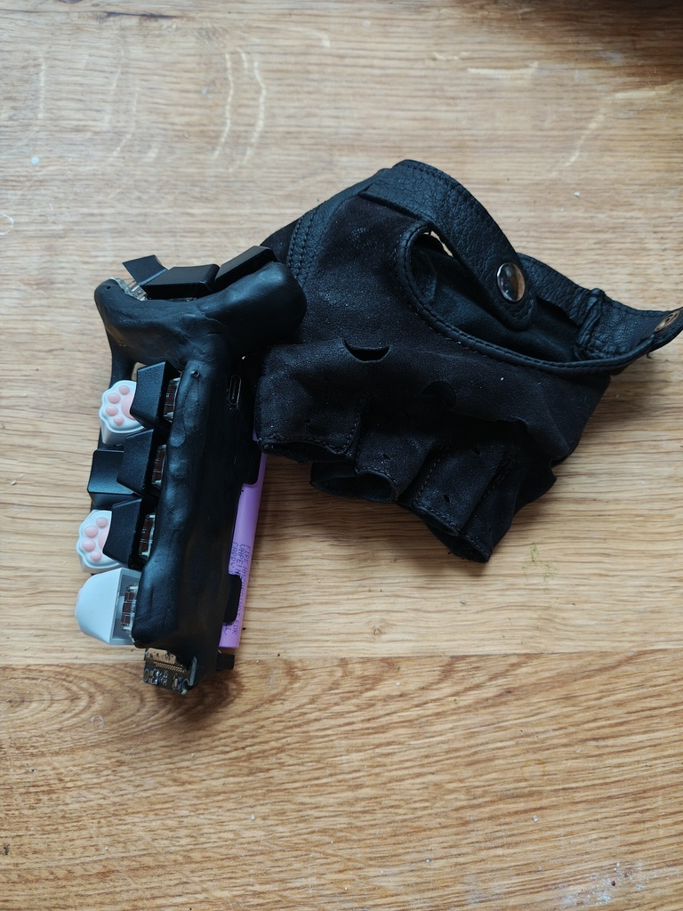

# 𝖒𝖆𝖋's Keyer 🎹

Firmware & goodies for making a [Keyer](https://en.wikipedia.org/wiki/Keyer) (one-handed version of a [chorded keyboard](https://en.wikipedia.org/wiki/Chorded_keyboard)).
## Photos

<table>
  <tr>
    <td></td>
    <td></td>
  </tr>
  <tr>
    <td></td>
    <td></td>
  </tr>
  <tr>
    <td></td>
    <td></td>
  </tr>
</table>

**Features**:

* **Minimal finger movement**: it's like typing with all the keys on your home row all the time
* **Free hand while typing**: you can use your other hand to sip tea while typing (or move the mouse - if you're not a tea drinking type)
* **Always near your hand** - keyer can be attached to a glove so you can just release it and have both of your hands free. Now you can drink your tea and move the mouse at the same time.
* **Tons of chords**: a 10-key keyer (3 keys on thumb, 2 index, 2 middle, 2 ring, 1 pinky) can express up to 215 chords (&times; 2 when counting hold-chord alternatives). With so many chords you can lose a finger and still touch type (carpenters love it!)
* **Arpeggios**: an additional 2 &times; 78 arpeggios - rolling motion over two keys that can be executed in two directions and can be used for even more input options.
* **Multiple layers**: if the 586 shortcuts available on the base layer are somehow not enough for you
* **Rolling chords**: when two subsequent chords you're entering share some finger positions you can only move the finger that changes position. When combined with optimized layouts (see the next point) typing is like walking through the keys one finger at a time.
* **Optimized layout**: a bundled layout optimizer will perform a combinatorial search over all possible layouts to find the optimal one for typing the texts that you give it (or for your custom finger press / finger movement cost function)
* **Ergonomic layout 🖖**: did you know your fingers share the neuro-motor pathways and can't always move independently? The layout generator will avoid finger combinations that are hard to press.
* **Low-latency**: the firmware relies on hardware interrupts and a zero-latency digital debouncing algorithm to make the keys more responsive than polling-based keyboards (and keyboards with capacitor-based debouncers).
* **Power for months**: a massive 18650 battery + underclocked CPU + firmware able to sleep without losing the Bluetooth connection + hardware power switch on the board mean that you will charge it about as often as a Casio watch.
* **🕶️**: combine it with smart glasses to control your computer (or smartphone) without looking or touching. It's like [Meta EMG wristband](https://www.youtube.com/watch?v=wteFJ78qVdM) but actually working!
* **Easy to build**: did you ever play with Play-Doh? This keyer was built with modelling clay (baked in the oven for 30 minutes). No 3D printing. No custom PCBs. You can make it with parts from amazon, a hot glue gun and a soldering iron.
* **Perfect fit**: you build it yourself, literally modelling it to the shape of your hand. You can't get more ergonomic than that.
* **Cheap to build**: it's less than 50 USD to make one yourself. Mechanical keyboards are a cheap hobby now!

## Interesting links

* [Penti Chorded Keyboard](https://software-lab.de/penti.html) - A software keyer that can run on a touchscreen. Notable for its use of arpeggios.
* [Keyyyyyyyys!](https://www.stavros.io/posts/keyyyyyyyys/) - Can you get cheaper than that?
* [ESP32-BLE-Keyboard](https://github.com/T-vK/ESP32-BLE-Keyboard/tree/master) - The best way to emulate a BLE keyboard from ESP32.

## Building instructions

*Welcome to the bottom of the ergonomic mechanical keyboard rabbit hole.*

Let's start with some shopping.

### Bill of materials

* [LILYGO T-Energy S3](https://lilygo.cc/products/t-energy-s3) development board ($9.70)
* [Samsung INR18650-35E](https://www.18650batterystore.com/products/samsung-35e) 3500mAh Li-ion battery (~$2.95)
* [FIMO professional modelling clay](https://www.staedtler.com/intl/en/products/fimo-modelling-clay-accessories/fimo-professional/fimo-professional-8040-oven-bake-modelling-clay-m8040/) ([$2.75](https://www.amazon.com/Staedtler-Professional-Hardening-Modelling-Chocolate/dp/B00WUCFIK8/))
   * Alternatively, one of the [FIMO effect](https://www.staedtler.com/intl/en/products/fimo-modelling-clay-accessories/fimo-effect/) modelling clays if you'd like to make your keyer out of [stone](https://www.staedtler.com/intl/en/products/fimo-modelling-clay-accessories/fimo-effect/fimo-effect-8010-stone-oven-bake-modelling-clay-m8010-stone/)
* 10 &times; [Gateron G Pro 3.0 mechanical switches](https://www.amazon.com/s?k=gateron+brown+10pcs) (~$10)
   * Alternatively other switches of your choice
* 10 &times; [Keycaps](https://www.amazon.com/s?k=keycaps+10pcs) (~$8)
   * You only need ten of them so feel free to get the [coolest](https://www.amazon.com/s?k=cat+paw+keycap) keycaps you can find
* 1m &times; AWG 18 rigid, insulated copper wire (~$1)
   * Get it from a local hardware store, the online stores are ripping you off
   * You can come with your development board to see which wire gauge fits through the holes on the board

Total: $34.40 (+shipping)

### Tools

* pliers - for bending the copper wire
* a knife (or a set of sharp teeth) - for stripping the cable insulation
* (optional) nitryl gloves - for not getting dirty while working with the modelling clay
* hot glue gun + hot glue sticks - for attaching the components to a wire scaffolding
* soldering iron + solder wire - for soldering

### Forming a skeleton (day 1)

With all the materials and tools in hand, the first step is to form a metal scaffolding which will hold the switches in convenient positions. Traditional electronics devices tends to have "exoskeletons" - they're supported by an external case that surrounds them and protects them from your greasy fingers. This device is built around an endoskeleton of copper wire. We'll cover this endoskeleton with modelling clay in a moment. I hope you bought the thickest wire you could (while still fitting through the holes on the board) because in this device it's structural.

We'll start with a "GND loop". Cut a section of wire - about 20 or 30cm. Strip its insulation & insert it into one of the GND holes on the board. Solder it in place - it should be firmly attached to the board. Insert the battery and take the board in your hand. Position it like you'd like it to stay in your hand and start bending the wire into a loop that goes through all the places where key switches bases are going to be placed. For some extra rigidity (long wire is fairly bendy) lead the other end of the wire back into another GND hole on the board. You can take the switches with keycaps and place them so that one of their contact points touch the wire. This will give you a better idea of how the keyer is going to end up looking. Don't worry about it being wobbly - we'll use this property to model it a little in a moment. First complete the loop by soldering the other end of the GND loop to the board. If your GND loop happens to pass near other GND holes, you can insert short sections of wire to increase the rigidity of the construction.

Once GND loop is complete, take your key switches and attach them to the GND loop so that one of their contact points makes an electrical contact. You can solder them directly but it's a good idea to start with some hot glue to hold them in place. In my version I also bent the contacts on the key switches to make them smaller (DIY low profile) and to take less space.

As you're going through the process the keyer is going to become more "complete" and you will be able to bend the wire a little to improve key positioning. Remember that hot glue and solder don't form particularly strong bonds so be careful about bending and ideally use pliers to do that precisely.

One word of advice about key positioning is that I've noticed that the keys are "nicest" to press when the axis of pressing goes straight into the palm of your hand. Motions that go parallel to palm of the hand, motions that extend fingers and motions that move fingers to the side are pretty awkward and uncomfortable. I guess our hands evolved to hold things, rather than poke or flick at them. [Some keyboard manufacturers](https://www.charachorder.com/) might disagree. Their keyboards look undeniably awesome, but this is your keyer and it should be comfortable to use - so make sure the keys are pressed in the same direction that you'd hold something.

Once you attached all of the keys, it's time to add even more rigidity into our construction. We'll do this by connecting the remaining contact points on the switches to the GPIO holes on the board. They're marked on the board with text that says "IO##". It doesn't matter which IO port you choose, but write down which key goes to which IO port - it's something that will have to be entered in the firmware. Take a short cut of the wire, strip it at both ends. Bend it (with pliers) so that it fits in the hole and goes straight to the switch. Then solder it in place at both ends. It's important that the wires going to the IO ports don't touch the GND loop. Insulation should help with that.

After this step, the keyer should be fairly rigid. Mount the keycaps and see how it feels. It's obviously a little "spiky" but we'll deal with that in the next step. Right now bend the wires to put all the key switches in their right positions.

At this point you can go to the "Flashing Firmware" section and check out how your keyer works! It's good to see if you didn't mess anything up so far. The hardest part is over!

### Putting on the skin (day 2)

Now is the time to open up the modelling clay and use it to cover our keyer. Before you begin, remove the keycaps, as they'll only get in the way. Take a small amount of clay and start shaping it in your hand. Squeeze it and fold in half. Repeat this about twenty times. Modelling clay must be mixed like that a little to prevent it from crumbling.

Once you have your warm and soft piece of clay, slap it on top of the keyer - wherever you want to cover something. It's important to cover the bottom parts of the switches - that's the part that may prick your fingers. Everything else is optional. I decided to keep my development board mostly visible and only covered the wires.

As you're sticking pieces of clay, one after another, you may find the resulting shape a little bit ugly. Turns out modelling stuff out of clay is hard! I've found a couple of tricks that may help you:

1. Add clay in **layers**. Take a small ball of clay and place it between two popsicle sticks. Roll it into a flat disc with a rolling pin. Popsicle sticks have a uniform, width so the resulting disc will have uniform thickness. Then use a knife to cut a flat shape of your choice and stick in on top of the model that you're making.
2. If you see a gap between chunks of clay - **rub them**. Keep rubbing them until the gap disappears. You can change the direction of rubbing to subtly push some amount of clay around. It can be used to even up tiny hills and valleys.
3. The best way of evening uneven edges is to use a **knife**. Ideally a wallpaper knife. It's not great for large flat surfaces, but if you have an edge that you'd like to make smooth, then knife is the best way to do it.
4. This is a cool one. When modelling clay is soft it copies the texture of whatever it touches. You can use a piece of fabric to make it look like a fuzzy fabric. If you take a glass you can make it glossy. Look around you and see what nice textures you have around.

You can try to take the keyer in your hand at this point but be careful. The clay is very pliable and may deform under the pressure of your hand.

One useful thing at this point is to try to put on the keycaps and to see whether they can be pressed all the way in. If they cannot - then either the clay (or the keycap) has to be trimmed. At this point the clay is still soft so it's easy to correct it.

Once you're done with modelling (it can take a couple of hours) heat up an oven to 110°C and put your keyer inside. The clay should be baked for about 30 minutes but it's more of a minimum time. Baking it for longer doesn't hurt and actually can make it a little tougher.

Oh, I hope you removed the battery before putting the keyer in the oven. If you didn't then you'll have to get a new one (oven). And call the fire department.

Assuming you removed the battery beforehand, after baking, the clay should be fairly tough - roughly as hard as high quality plastic.

### Flashing Firmware (day 3)

1. [Install PlatformIO Core](https://docs.platformio.org/page/core.html)
2. Connect the T-Energy S3 development board to your computer via USB.
3. Run these commands:

```shell
# Clone this repository
$ git clone https://github.com/mafik/Keyer.git

# Enter the cloned directory
$ cd Keyer

# Build project
$ pio run

# Upload firmware
$ pio run --target upload
```

4. Open Bluetooth settings on your phone or PC. If you see a device called "𝖒𝖆𝖋.🎹", that means it's working.
5. Go to a text editor and find `ChordKeyboard.cpp`. Change the `kButtonPin` array to the IO ports that you used for connecting the switches. Feel free to explore this file and experiment.
6. Enable serial output by uncommenting the `Serial.begin` line and running the program with `pio run --target upload --target monitor`. This will let you see what the board is doing while you're fiddling with the code and pressing the keys.

### Optimizing layouts (day 3+)

It's getting late so this is the point at which I'll leave you on your own. I'll just mention that you can put some text files in the `layout_generator/corpus` directory and run the `planner.py` script to find a perfect layout for your own keyer & typing preferences. You can tweak the `keyer_simulator.cpp` to adjust finger press & movement costs. Within `planner.py` you'll find some code for generating layouts that follow some memorable patterns. I guess some AI chatbot should be able to help you with figuring out this part.

The default layout was generated using a mix of English, Polish, C++ and Python code so you might benefit from dropping some of your favorite texts and seeing what comes out.

## Ideas

* Add an I2C [6-axis accelerometer](https://www.sparkfun.com/sparkfun-micro-6dof-imu-ism330dhcx-qwiic.html) and make the keyer function as an air mouse (like some LG remotes)
* Reduce the number of keys - 6 keys (2 thumb, 1 index, 1 middle, 1 ring, 1 pinky) should actually be enough for most uses

## Misc commands

```shell
# Tweak FreeRTOS configuration
$ pio run --target menuconfig

# Clean build files
$ pio run --target clean
```

## Repository structure

* `layout_generator/` - a set of Python scripts for generating an optimized chord layout
  * `corpus/` - directory for text files that will be used for evaluating the layout
  * `planner.py` - main entry point for doing the optimization
  * `qwerty_analysis.py` - converts the text files into a sequence of equivalent IBM PC keyboard keys
  * `keyer_simulator.cpp` - simulates text entry on the keyer
  * `beam_optimizer.py` - optional utility to double-check whether the generated layout is (locally) optimal
* `src/` - code that runs on the ESP32
* `sdkconfig.ChordKeyboard` - configuration for the ESP-IDF firmware
